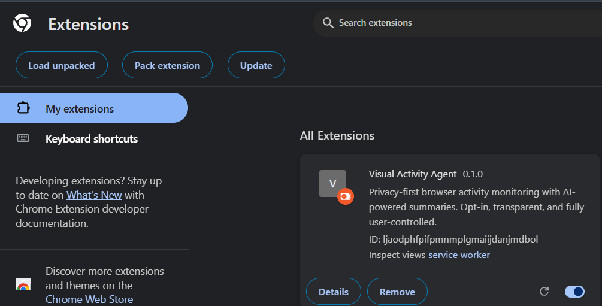
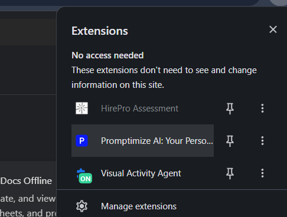
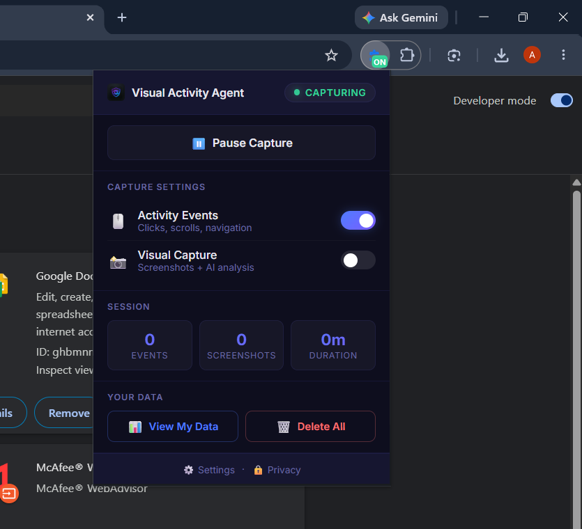
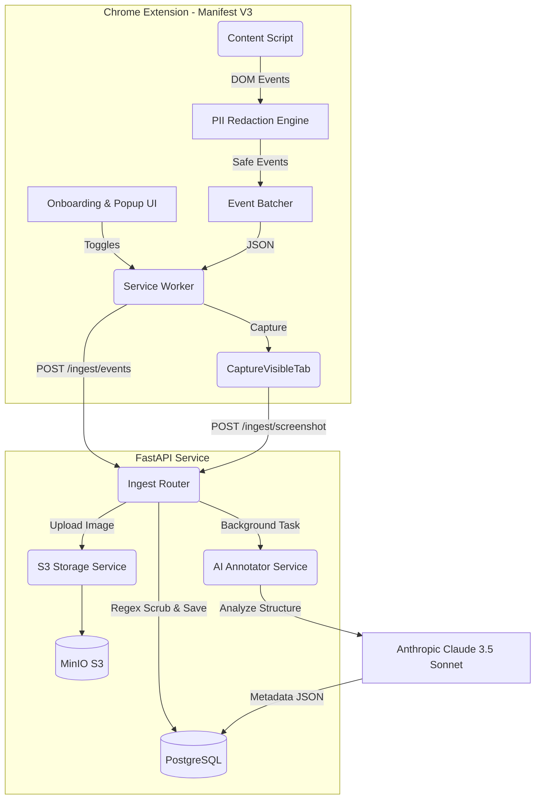

<div align="center">
  <h1>Visual Activity AI Agent</h1>
  <p><strong>A privacy-first, production-ready browser activity monitoring system built for transparency, control, and advanced AI-driven structural analysis.</strong></p>
</div>

<br />

## 📸 Screenshots

<div align="center">
  
  <br/>
  <em>Privacy-First Onboarding Flow</em>
  <br/><br/>
  
  <br/>
  <em>Extension Popup UI & Stats</em>
  <br/><br/>
  
  <br/>
  <em>Local Data Viewer with AI Summaries</em>
</div>

## 🚀 Why This Project?

This project was built to demonstrate **Senior-Level Full-Stack Engineering** practices with a heavy emphasis on:
- **Privacy by Design**: Ensuring sensitive data (passwords, credit cards, SSNs) never leaves the user's browser.
- **Production-Ready Code**: Asynchronous backend architecture, comprehensive unit testing, and robust database migrations.
- **Immaculate Git History**: Built iteratively using strict conventional commits and feature branches without squashing, showcasing a logical evolution of complex features.

## 🏗️ System Architecture



## 🔒 Privacy-First Design Philosophy

The core constraint of this system is that **user trust is paramount**.

1. **Consent Gated**: The extension installs in an `OFF` state. No data is captured until the user explicitly completes the onboarding flow and toggles it on.
2. **Point-of-Capture Redaction (Defense in Depth #1)**: The client-side DOM inspector checks input fields *before* capturing. Values from `type="password"` or `autocomplete="cc-number"` are physically never read by the JavaScript engine.
3. **Regex Scrubbing (Defense in Depth #2)**: Both the extension and backend independently scrub inputs and URLs for SSNs, credit cards, and emails.
4. **AI Anonymity**: The prompt sent to the LLM (Claude 3.5 Sonnet) strictly enforces structural categorization (e.g., "shopping cart dashboard") and forbids extracting exact text.
5. **Right to be Forgotten**: Users can view their raw data via a local dashboard and execute a single-click **Delete All Data** command that performs a cascading purge across PostgreSQL and S3.
6. **Retention Purge**: An automated background loop enforces a strict 30-day data retention limit.

*(For detailed technical specifications, see [`docs/PRIVACY.md`](docs/PRIVACY.md))*

## 🛠️ Technology Stack

**Extension (Frontend)**
- Chrome Extension Manifest V3
- Vanilla JavaScript (ES Modules, Service Workers, Content Scripts)
- Chrome Storage API & `captureVisibleTab`
- **Testing**: Vitest

**Backend**
- Python 3.12+ & FastAPI
- **Database**: PostgreSQL 15, SQLAlchemy 2.0 (Async), Alembic (Migrations)
- **Storage**: MinIO (S3-compatible) & Boto3
- **AI/LLM**: Anthropic SDK (Claude 3.5 Sonnet)
- **Infrastructure**: Docker & Docker Compose

## ⚙️ Local Setup & Running

### 1. Requirements
- Node.js 18+ (for extension tests)
- Python 3.12+
- Docker & Docker Compose

### 2. Start Infrastructure
Start the database and object storage:
```bash
docker-compose up -d
```
*(PostgreSQL runs on port 5432, MinIO API on 9000, MinIO Console on 9001).*

### 3. Backend Setup
Set up the Python environment and run migrations:
```bash
cd backend
python -m venv venv
# Activate: `source venv/bin/activate` or `.\venv\Scripts\activate`
pip install -r requirements.txt

# Configure Environment
cp .env.example .env
# (Optional) Add ANTHROPIC_API_KEY to .env for AI screenshot annotations

# Initialize Database
alembic upgrade head

# Start API server
uvicorn app.main:app --reload
```

### 4. Extension Setup
1. Open Chrome and navigate to `chrome://extensions/`
2. Enable **Developer mode** in the top right.
3. Click **Load unpacked** and select the `extension` directory from this project.
4. The custom onboarding flow will launch automatically.

## 🧪 Testing

The critical privacy logic (PII Redaction & Batching) is thoroughly unit tested.
```bash
cd extension
npm install
npx vitest run
```

## 📈 Git Strategy

This repository demonstrates professional version control:
- Small, atomic commits with conventional commit messages (`feat:`, `fix:`, `test:`).
- Feature branch workflow for all major phases.
- Real merge commits (`git merge --no-ff`) to preserve the true history and context of feature development. 
